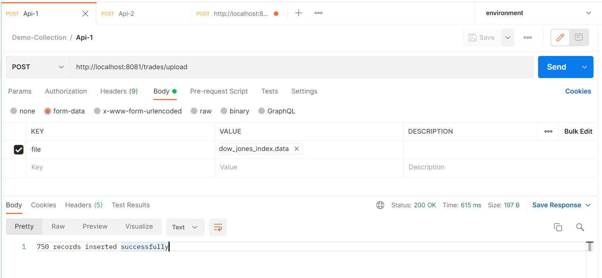
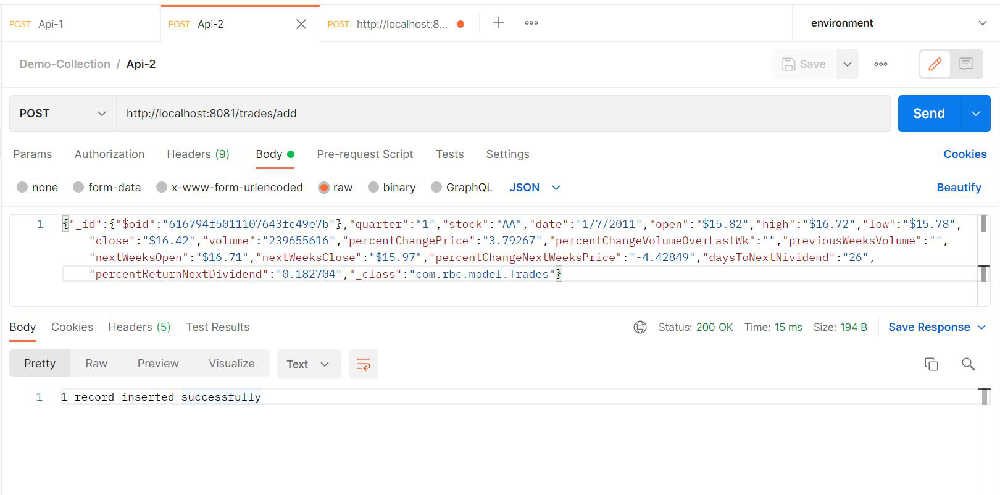
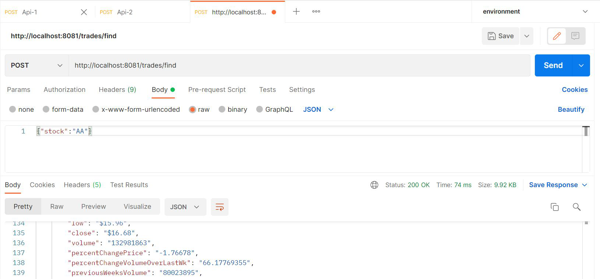

## Installation

To run this project simply go to the root directory of the project & run below given commands
- docker-compose build : this will build 2 images of our app & mongodb
- docker-compose up : this will run the docker images and start the containers
- Rest api endpint will be http://localhost:8081 
- Mongodb endpoint will be mongodb:27017

---

## Endpoints Testing

#### http://localhost:8081/trades/upload (POST) : to upload the provided data file

---

#### http://localhost:8081/trades/add (POST) : to add single trade

---

#### http://localhost:8081/trades/find (POST) : to find similar trades

